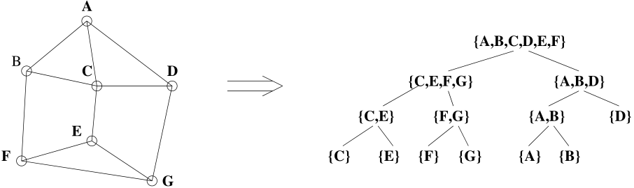
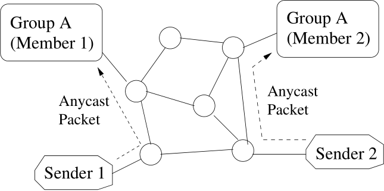
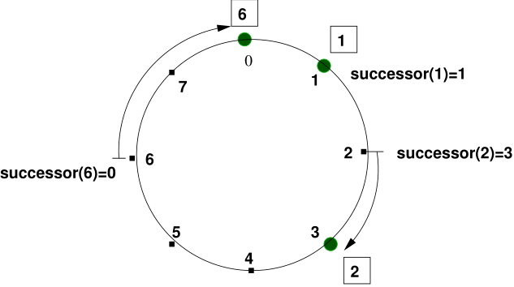
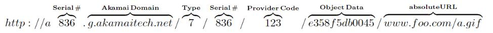
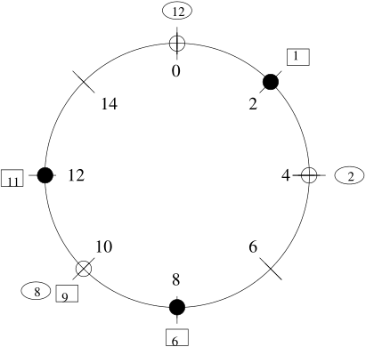

# CDN: Content Distribution Network∗
source: https://arxiv.org/pdf/cs/0411069.pdf
## Abstract
**Problem:**
the available network bandwidth and server capacity continue to be overwhelmed by the skyrocketing Internet utilization and the accelerating growth of bandwidth intensive content.

**How CDN works:**
CDN replicates the content from the place of origin to the replica servers scattered over the Internet and serves a request from a replica server close to where the request originates.

**In this paper:**
- give an overview about CDN.
- present the critical issues involved in designing and implementing an effective CDN
- survey the approaches proposed in literature to address these problems
- present a scheme that provides fast service location for peer-to-peer systems, a special type of CDN **with no infrastructure support.❓**
>**with no infrastructure support** 根据后文看意思是指不用通过增加硬件设备、带宽等来达到目的。<br>**"with infrastructure support":**
One might think that the constant improvement in the bandwidth of Internet infrastructure, for example, the availability of high-speed "last mile" connection of the subscribers to the Internet and the backbone fibers, and the increasing capacity of the various servers would reduce or eliminate the access delay problem eventually.<br>
from: Introduction

## 1. Introduction
### Problem
Although the time to load the content of key Internet sites has improved constantly over the last several years, overall Web content access latency is still in the range of a few seconds, which is several times the threshold believed to represent natural human reading/scanning speeds.（资源下载速度还是太慢了）

### Why the problem come into existence
- lack of overall management for Internet
  -  the absence of overall administration in turn makes it very difficult to guarantee proper performance and deal systematically with performance problems.
- as the load on Internet and the richness of its content continue to soar, any increase in available network bandwidth and server capacity will continue to be overwhelmed.

These two facts not only elevate the delay in accessing content on Internet, but also make the access latency unpredictable.

### How to deal with it, the CDN way
The basic approach to address the performance problem is to move the content from the places of origin servers to the places at the edge of the Internet.

**Benefits**
- has better performance (lower access latency, higher transfer rate) than from the origin server
- using multiple replica servers for servicing requests costs less than using only the **data communications network❓** does

  > Data Communications: Data transmission and data reception or, more broadly, **data communication** or digital communications is the transfer and reception of data in the form of a digital bitstream or a digitized analog signal[1] over a point-to-point or point-to-multipoint communication channel.<br>from: https://en.wikipedia.org/wiki/Data_communication

**How dose the CDN do:**
CDN replicates a very selective set of content to the replica servers and only sends those requests for the replicated content to a replica server.

**Key challenges:**
- How to place replica servers
- distribute content copies to replica servers
- how to route the requests to the proper replica server having the desired content 

## 2. Overview
...
the fact that many objects are **not cacheable but replicable❓**, which include dynamic objects with read-only access and personalized objects (e.g., "cookied" requests), makes CDN indispensable.

<br>
Figure 1: System Architecture Components of a CDN
### 2.1 A General Architecture of CDN
**Relationships of the parts in the above figure.** The relationships among these components are represented with the numbered lines in Figure 1 and are described as follows [[GCTT00](https://readpaper.com/pdf-annotate/note?pdfId=4546228858012721153&noteId=698482667719512064#cite.Green), [DCTR01](https://readpaper.com/pdf-annotate/note?pdfId=4546228858012721153&noteId=698482667719512064#cite.Day1)]:
1. 源站（origin server）为想要缓存的文件对象**分配URI并发送给请求路由系统**（request routing system）。
2. 源站（origin server）将想要缓存的资源发布到分发系统（distribution system）中。
3. 分发系统（distribution system）将资源发送到缓存/副本服务器（replica server）。另外，分发系统和请求路由系统交互，通过反馈来为客户端请求选择合适的副本服务器。
4. 客户端从它认为是源站的地方请求文档。然而，由于URI命名空间委托，请求实际上被导向了请求路由系统。
5. 请求路由系统把请求路由到CDN中合适的副本服务器。
6. 被选中的副本服务器将请求的资源分发给客户端。另外，副本服务器会将分发资源的会计信息（accounting information）交付给会计系统（accounting system）。
7. 会计系统聚合并蒸馏会计信息为统计信息以及资源的详细记录，供源站以及出账组织（billing organization）使用。统计信息也用于给请求路由系统反馈。
8. 出账组织用资源详细记录来和资源分发以及递交处理过程的各方进行协商。

### 2.2 Distribution System
Two dominating approaches to distribute content to replica servers.
#### 2.2.1 Using Internet
CDN establishes and maintains a **distribution tree** or an **overlay network** over the existing Internet infrastructure and disseminates content from the origin server to the replica servers via the tree or overlay.

How to establish and maintain the distribution overlay or tree is the major technical concern.

This approach might suffer from the unpredictability and problematic performance of the Internet itself.
#### 2.2.2 Using broadcast satellite
Data satellite broadcast has the potential for remarkable cost savings, and it provides a high-quality, predictable performance path for sending critical content such as real-time streaming media.
### 2.3 Replica Placement
Replica placement deals with how many replicas each object has and where in the network to place them.

**two issues**:
* replica server placement: the problem of **placing the replica servers on the Internet**
  * Should be placed closer to the clients
* object replica placement: about on which replica server and how to **place a particular object replica**
  * Should be placed to even the load of the replica servers in CDN, trying to balance the load among replica servers

**Some theoretical approaches**. These models are variations of or based on the *center placement problem*. Due to the computational complexity of these algorithms, heuristics have been developed. 
> A heuristic, or heuristic technique, is any approach to problem solving or self-discovery that employs a practical method that is not guaranteed to be optimal, perfect, or rational, but is nevertheless sufficient for reaching an immediate, short-term goal or approximation.<br>source: https://en.wikipedia.org/wiki/Heuristic

Required information:
* Workload pattern
* Network topology

**Insight from Web caching system**: Object replica placement has been well studied in Web caching system. Cooperation between caching nodes can improve the overall performance significantly.
system
### 2.4 Request Routing System
Major criteria used to choose a proper replica server:
* Proximity between the client and the selected replica server
* The replica server load

#### Server location
* Determine the distance between the requesting client and a server.
  * Hop counts and roundtrip times<br>Not sufficient and accurate, the former does not account for the network traffic situation and the latter is highly variable.
* Determine the load of a replica server.
  * Server push: the replica servers propagate the load information to some agents.
  * Client probe: the agents probe the status of the servers of interest periodically.

#### Request routing
* **Client multiplexing**: the client or a proxy server close to the client **receives the addresses of a set of candidate replica servers** and chooses one to send the request.
  * *Generally, this scheme imposes additional overhead in sending the set of candidate replica servers to the client when requesting some content.❓*
  * Due to lack of overall information, the client may choose a server with high load
* **HTTP redirection**: requests for content make it all the way to the origin server, at which point the server re-directs the browser to a new URL at the HTTP protocol level.
  * Simplest and probably the least efficient means, because the origin server or server cluster is the only point responsible for redirecting requests
* **DNS indirection**: uses Domain Name System
* **Anycasting**: an anycast address/domain name, which can be an IP anycast address or a URL of content, is used to define a group of servers that provide the same service. A client desiring to communicate with only one of the servers.
  
  > **Anycast** delivers a message to any one out of a group of nodes, typically the one nearest to the source using a one-to-one-of-many association where datagrams are routed to any single member of a group of potential receivers that are all identified by the same destination address. The routing algorithm selects the single receiver from the group based on which is the nearest according to some distance or cost measure.<br>source: https://en.wikipedia.org/wiki/Anycast
  * This anycast-aware routing can be integrated into the existing Internet routing infrastructure, thereby providing request routing service to all the CDNs.
  * This scheme has the potential to scale up well with the growth of the Internet.
* **Peer-to-Peer Routing**: no nodes have the complete global information in time about the network. The problem of routing requests efficiently in a distributed manner without incurring high overhead of propagating the routing information is a major research concern.

## 3. Server Placement
In this section, we survey **the approaches to server placement** described in the literature along with their **contributions and inadequacies**.

**Key points**:
* to decide where on the Internet to place the servers,
* which store replicates of objects.

**metrics**:
* **latency**: the average content access latency perceived by clients
* **bandwidth**: the overall network bandwidth consumption for transferring replicated documents from servers to clients.

### 3.1 Theoretical Approaches
**Center placement problem definition:** for the placement of a given number of centers, one could consider
the metric (P<sub>minK</sub>) of minimizing the maximum distance between a node and the nearest center. This problem is also known as the minimum K-center problem [JJJ+00].

**Notations**:
* the network is represented by a graph G(V, E)
* V is the set of nodes
* E ⊆ V × V is the set of links
* use N = |V | to denote the number of nodes in G
* use T to denote the number of centers we place in the graph
* dG(u, v) to denote the distance between nodes u and v in the graph G

#### 3.1.1 k-HST
##### The way of partition

The k-HST algorithm consists of two phases:
1. the graph is recursively partitioned
   1. A node is arbitrarily selected from the current (parent) partition, **all the nodes that are within a random radius from this node** form a new (child) partition.
   2. 子分区的半径值要比父分区的直径小k倍。*The value of the radius of the child partition is a factor of k smaller than the diameter of the parent partition.*

      > **图论-半径**：一张图的半径 r 被定义为所有顶点偏心率中最小的偏心率<br>
      > **图论-偏心率**：一个顶点v的偏心率被定义为v和其它顶点的距离的最大值，也即是这个点和离其最远点的距离<br>
      > **图论-直径**：一张图的直径 d 被定义为最大的偏心率，也即最远的两点间的距离。<br>
      > 来源：https://zh.m.wikipedia.org/zh-hans/%E8%B7%9D%E7%A6%BB_(%E5%9B%BE%E8%AE%BA)
   3. This process recurs for each partition, until each node is in a partition of its own.
2. a virtual node is assigned to each of the partitions at each level
   1. The length of the links from a virtual node to its children is half of the partition diameter.

 Generating a 1-HST tree based on the algorithm described above from a graph.

 

##### The way to find the number of centers

Taking advantage of this characteristics of the resulting k-HST tree, the following greedy algorithm can be devised to find the number of centers needed when the maximum center-node distance is bounded by D.

**Notations**
* r: the root of the partition tree
* N<sub>i</sub>: the children of node i on the partition tree
* L: a list of partitions sorted in the decreasing order of the partition diameter at all times
* H<sub>L</sub> denotes the partition at the head of the list
* diam(<sub>L</sub>): H<sub>L</sub>'s diameter.

The following shows the greedy algorithm on the k-HST tree.
```
L ← Nr
while( diam(HL) > D)
begin
  h ← HL
  L ← L − HL
  L ← L ∪ Nh
end
```
The algorithm pushes the centers down the tree until it discovers a partition with diameter ≤ D. The number of partitions, |L|, is the minimum number of centers required to satisfy the performance metric Pdiam.

##### limitations

#### 3.1.2 Minimum K-center
**NP-complete, but solvable**

The minimum K-center problem is NP-complete. However, if we are willing to tolerate inaccuracies within a factor of 2, i.e., the maximum distance between a node and the nearest center being no worse than twice the maximum in the optimal case, the problem is solvable in O(N|E|) [Vaz99] as follows.

a graph G = (V, E)
* all its edges arranged in non-decreasing order by edge cost
* Gi = (V, Ei), where Ei = {e1, e2, ...ei}
* G<sup>2</sup>: A square graph of G, is the graph containing V and edge (u, v) wherever there is a path between u and v in G of at most two hops.
  * u ≠ v — hence some edges in G<sup>2</sup> are pseudo edges, in that they do not exist in G.
  * 💡 n次方图的含义为，u,v间长度为n的路径的存在性，2次方图对应的矩阵，如果存在不为零的元素，则代表存在长度为2的一条路径，使对应的两个点连通。
* An **independent set** is a subset V ′ ⊆ V such that, for all u, v ∈ V ′, the edge (u, v) is not in E.
  * An independent set of G<sup>2</sup> is thus a set of nodes in G that are at least three hops apart in G.

💡实例

假设图G邻接矩阵m为：
```
0, 0, 1, 0, 0, 0, 0
0, 0, 0, 0, 0, 1, 0
1, 0, 0, 1, 0, 0, 0
0, 0, 1, 0, 0, 0, 1
0, 0, 0, 0, 0, 1, 0
0, 1, 0, 0, 1, 0, 1
0, 0, 0, 1, 0, 1, 0
```
G<sup>2</sup>邻接矩阵则为：
```
m square
0, 0, 0, 1, 0, 0, 0
0, 0, 0, 0, 1, 0, 1
0, 0, 0, 0, 0, 0, 1
1, 0, 0, 0, 0, 1, 0
0, 1, 0, 0, 0, 0, 1
0, 0, 0, 1, 0, 0, 0
0, 1, 1, 0, 1, 0, 0
```
G<sup>2</sup>的无关集合邻接矩阵则为：
```
0, 1, 0, 0, 1, 1, 1
1, 0, 1, 1, 0, 0, 0
0, 1, 0, 0, 1, 1, 0
0, 1, 0, 0, 1, 0, 0
1, 0, 1, 1, 0, 0, 0
1, 0, 1, 0, 0, 0, 0
1, 0, 0, 0, 0, 0, 0
```
即全连接图减去G与G<sup>2</sup>

TODO
### 3.2 Heuristic Solutions
**not practical**: The theoretical solutions described above are either computationally expensive or do not consider the characteristics of the network and workload.

#### 3.2.1 Greedy Algorithm
A greedy algorithm was proposed by P. Krishnan et al. [KRS00] for the cache location problem. Qiu et al. [QPV01] adapted this algorithm for the server placement problem in CDN.

Suppose it needs to choose M servers among N potential sites. It chooses one site at a time. picks the site that yields the lowest cost, e.g., the bandwidth consumption. The iteration continues until M servers have been chosen.

Jamin et al. [JJR+01] discussed a more general algorithm: ℓ-backtracking greedy algorithm. removing ℓ of the already placed servers and replacing them with ℓ + 1 new servers

...They utilized two types of network topologies: one by simulating the network as random graph and another one by deriving the real topology from BGP routing table. Under this experimental configuration, the greedy algorithm performs remarkably well (within a factor of 1.1-1.5) compared to the computationally expensive optimal solution and the computation needed is several magnitudes less.

#### 3.2.2 Topology-informed Placement Strategy
A topology-informed placement strategy, called "Transit Node", was first discussed by Jamin et al. [JJR+01].  Assuming that nodes with the highest outdegrees2 can reach more nodes with smaller latency, we place servers on candidate hosts in descending order of outdegrees.

The result shows that the transit node heuristic can perform almost as well as the greedy placement, and that using router-level topology information results in better performance than that achieved by only exploiting ASlevel topology knowledge.

## 4. Request Service
Two steps of operations are involved in servicing a request in a CDN:
* `server location`: locating a suitable server holding the replicates of the requested object
* `request routing`: redirecting the request to the selected server

### 4.1 Server Location
The first choice about server location strategy is whether server location information is gathered in reaction to client requests for nearby servers, e.g., using a multicast scheme, or whether this information is gathered proactively.

The next choice is whether support should be provided by the routing layer.

**Reactive vs. proactive gathering**

given a multicast group joined by all instances of a particular type of server, one can choose the server that responds most quickly to a group multicast message. This approach wastes the precious network bandwidth.

In contrast, in a proactive scheme, some agents, such as routers or dedicated applications, gather the network and server information by sending probe messages to the candidate servers or collect load information dispatched by servers, and maintain the server location or load database.

**Routing layer vs. application layer**

Partridge et al. [PMM93] proposed an anycasting mechanism, particularly in IP layer, which attempts to deliver a request to one nearby server. However, a downside is that IP anycasting assumes that all servers provide equal service3.

In contrast to IP anycasting, an application-level location service could include server quality into the selection criterion, after a handful of nearby servers have been selected from the database.

**Polling routing table vs. network probing**

By polling routing tables, we can build a connectivity graph from a measurement beacon to one server by retrieving the local routing table, determining the next hop along the path, retrieving the routing table for that router, and so on, until we reach the destination.

In network probing approach, some measurement servers are responsible to explore the route to each of the replica servers by probing the servers.

### 4.2 Request Routing
#### 4.2.1 Client Multiplexing
In this approach, the client (Web browser or a proxy server) obtains the addresses of a set of physical replica servers and chooses one to send its request to. Three main mechanisms belong in this category.

**1. The DNS server of the service provider returns the IP addresses of servers holding a replica of the object.**

The client's DNS resolver chooses a server among these.

**How to dicide**:
* issue probes to the servers and choose based on response times to these probes
* collect reports from the clients on performance of past accesses to these servers.

**Shortcomings**:
* relies on clients using a customized DNS resolver.
  * If this resolver relies on client performance reports, then the client (i.e., browser or proxy) software must be modified as well
* the DNS infrastructure relies heavily on DNS response caching to cope with its load.
  * replica server sets cannot be changed frequently without the danger of resolvers using stale replica server sets.
* moves the stability bottleneck to the DNS infrastructure

####  4.2.2 DNS Indirection
Web site's DNS server to map a host domain name to a set of IP addresses and choose one of them for every client query.

Unfortunately, DNS system was designed for mostly an append-only database of existing mappings between a host name and an IP address that rarely ever changes.

#### 4.2.3 HTTP Redirection
HTTP protocols allow a Web server to respond to a client request with a special message that tells the client to re-submit its request to another server.

A disadvantage is that this mechanism is quite heavyweight. Not only does it introduce an extra message round-trip into request processing, but also this round-trip is done over HTTP, which uses the expensive TCP protocol as the transport layer.

### 4.3 Anycasting
IP anycasting assumes that the same IP address is assigned to a set of hosts, and each IP router has in its routing table a path to the host that is the closest to this router. Thus, different IP routers have paths to different hosts with the same IP address. Figure 4 illustrates IP anycasting.



**Anycasting using unicast routing protocols is not scalable**

routing anycast packets using the unicast routing protocols requires advertising each global anycast address separately. This requirement causes the routing tables to grow proportionally to the number of all global anycast groups in the entire Internet, and hence does not scale.

**global IP anycast (GIA)**

...

#### 4.3.2 Application-Level Anycasting
* the network layer is able to effectively determine the shortest path, it is well suited for the IP anycasting service that selects the closest server based upon a shortest path metric such as hop count.
* an application layer approach is better suited at handling a variety of other metrics such as server throughput

**1. Fei et al. [FBZA98]**

In their design, the service consists of a set of anycast resolvers, which performs the anycast domain names (ADN) to IP address mapping. 

**Benefits:**
* A **key feature** of the system is the presence of **a metric database**, associated with each anycast resolver, containing performance data about replica servers.

**Downsides:**
* However, deploying such a system requires the changes to the servers as well as the clients, which is prohibitively costly considering the possibly huge number of servers and clients.

**2. Adjie-Winoto et al. [AWSBL99]**

It proposed an **intentional naming system (INS)**, which is designed as a resource discovery and service location system for dynamic and mobile networks of devices and computers.

**Benefits:**
* INS uses a simple language based on attributes and values for its names, which enable the service to be specified precisely

**Downsides:**
* INS is not designed to provide global reachability information, and the attribute-based naming is less scalable than a hierarchical namespace provided by URL.

**3. Gritter et al. [GC01]**

...

### 4.4 Peer-to-Peer Systems
Peer-to-peer systems build the information retrieval network on the members themselves instead of relying on a dedicated infrastructure like the traditional CDNs do.
* more fault-tolerant than the common CDNs
* more suitable for content producers who are individuals, who may not be able to access or afford the common CDNs, most of which are commercial ones.

**1. Freenet**

a distributed adaptive peer-to-peer system that enables the **storage** and **retrieval** of data while maintaining the **anonymity** of readers and authors.

* Nodes request a file store or retrieve service to their immediate neighbors using a **location-independent naming key**.
* Requests are **forwarded hop-by-hop**, a way similar to IP routing
* and have **a limited hops-to-live** as well as a unique random id number to avoid loops in routing.
* Each node has **a data store** to which it must allow network access, as well as **a dynamic routing table with keys associated with node addresses**.
* File keys are generated using **hash** functions.
* **Each file has a random public/private key pair** to serve as a namespace called signed-subspace key (SSK) and a keyword-signed key (KSK) generated by a short descriptive text.
  * A user publishes his descriptive string and subspace public key, and keeps his private key secret so that no other ones can add files to his subspace.

**solutions proposed to search for keys**:
insertion of indirect files by users with pointer to the real files, and publicizing public key compilations by users.

**Benefits**:
* Freenet does not assign responsibility for documents to specific servers; instead, its lookups take the form of searches for cached copies. This allows Freenet to provide a degree of anonymity

**Downsides**:
* but prevents it from guaranteeing retrieval of existing documents or from providing low bounds on retrieval costs.

**2. Chord protocol**

Ion Stoica et al. [SMK+01] presented the Chord protocol that is designed to **map a key onto a node** in a distributed, peer-to-peer network whose **size and composition change intermittently**.

**Chord is proposed to** meet the challenges faced by **large-scale peer-to-peer network**, namely:
* load balance
* decentralization
* scalability
* availability
* flexible naming

**The Chord protocol**



*Figure 8: An identifier circle consisting of the three nodes 0, 1, and 3. In this example, key 1 is located at node 1, key 2 at node 3, and key 6 at node 0.*
* employs the consistent hashing function to acquire two m-bit identifiers for the node and the key, respectively.
  * m is in the range of O(logN) and N is the number of nodes in the network
* The identifiers are **ordered** in an identifier circle **modulo 2m**, using which the keys may be assigned to the nodes with the successor node technique, as shown in Figure 8.

* Consistent hashing is designed to let nodes enter and leave the network with minimal disruption.
* Each node is responsible for at most (1 + ǫ)K/N keys, where K is the total number of keys. ❓ǫ代表什么，`(1 + ǫ)K/N`表示至少K/N个？
* Each node,n, maintains a routing table with (at most) m **entries**, called the **finger table**.
* The ith entry in the table at node n contains the identity of the first node, s, that succeeds n by at least 2<sup>i</sup>−1 on the identifier circle, 1 ≤ i ≤ m

  💡8个节点，m=3

  💡节点0：
  |i|least hops|id|
  |-|-|-|
  |1|(1 = 2<sup>1−1</sup>) + 0|1|
  |2|(2 = 2<sup>2−1</sup>) + 0|3|
  |3|(4 = 2<sup>3−1</sup>) + 0|-|
  
  💡节点1：
  |i|least hops|id|
  |-|-|-|
  |1|(1 = 2<sup>1−1</sup>) + 1|2|
  |2|(2 = 2<sup>2−1</sup>) + 1|3|
  |3|(4 = 2<sup>3−1</sup>) + 1|0|

**Addressing**:

When a node n looks for the node holding key k, 
* it searches its finger table for the node j whose ID most immediately precedes k.
* and asks j for the node it knows whose ID is closest to k.
* Eventually, node n finds the node holding k in O(logN ) steps.

**Net work resize**: When multiple nodes join or fail, a stabilizing routine is executed in the Chord in order to remap keys to the nodes so that the integrity of the identifier circle is maintained.

**Flaws**: 
* Chord needs specific mechanism to heal partitioned rings and security mechanism to tackle safety issues
  * e.g., malicious or buggy set of participants, which may present an incorrect view of the Chord ring.
* anonymity of participant is not taken into account in Chord.

## 5. An Example of CDN – Akamai
**Akamai also built its own DNS network**. This Akamai DNS network ensures fast delivery of the requested content by resolving the host name of the URL for the requested content to the IP address of the Akamai replica server

**Two major processes involved in the operation of Akamai**:
* How to direct Internet traffic to the Akamai server network
* How to direct requests to the suitable Akamai replica servers

### 5.1 ARLs and Akamaizer
**Akamaizer** is the tool that tags embedded Web objects for delivery via the Akamai network, transforming ("akamaizing") their URLs into **Akamai Resource Locators (ARLs)**.

A typical embedded object URL such as http://www.foo.com/a.gif would be transformed into the following ARL:



* `serial number`: identifies a virtual "bucket" of content – a group of akamaized objects that will always be served from the same set of Akamai replica servers.（一组数据由一组副本服务器共同服务）

### 5.2 The Akamai DNS System
The Akamai DNS system is implemented as a 2-level hierarchy of DNS servers:
* Each **HLDNS**(high-level) server is responsible for directing each DNS query it receives to a LLDNS server that is close to the requesting client.
* The **LLDNS** servers perform the final resolution of server name to IP address, directing each client to the Akamai replica server that is optimally located to serve the client's requests.

**resolve procedure: a browser makes a request for `a9.g.akamai.net`**

its local DNS server
   
(In the absence of a cached response, the local DNS server resolves the server name by using iterative DNS queries):
1. contacts a **.net root** server, responds with a list of ❓ Akamai HLDNS servers.
2. the local DNS server contacts **one of these HLDNS servers**, it receives a list of LLDNS servers that are close to it.
3. It then contacts **one of the LLDNS servers**, which returns the IP address of the optimal replica server for this request.


## 6. Iridium: A Fast Content Location Service for Large-Scale Peerto-Peer Systems
### 6.1 Related Work
The present routing protocols or services in peer-to-peer systems can be roughly classified into three categories *according to the number of nodes performing the routing operation.*

* A central node servicing all the routing requests in the system:
  * This centralized structure can **not scale well** for large system and is **error prone**
  * A more significant demerit of this structure is that the system using this routing structure can be easily censored
* Some peer-to-peer systems choose **a small set of "superpeers" or "supernodes"** by consensus to service the routing requests in the system rather than replying on a central node for routing.
* A completely distributed structure where each node participates in the routing procedure. Taking O(logN ) overlay hops to finish a request

### 6.2 System Structure
#### Hash Function
Essentially, Iridium provides distributed computation of a hash function **mapping keys to nodes** responsible for them within constant time.

It uses consistent hashing [KLL+97], which has several good properties:
* high probability the hash function **balances load**.
* when an Nth node joins (or leaves) the network, only an O(1/N ) fraction of the keys are moved to a different location.

**Fixed length key**: The consistent hash function assigns each node and key an m-bit identif ier using a base hash function such as SHA-1 [sha95].
* A node's identifier is chosen by hashing the node's IP address
* A key identifier is calculated by hashing the key

*We will use the term "key" to refer to both the original key and its identifier. Similarly, the term "node" will refer to both the node and its identifier under the hash function.*
#### Two Types of Nodes in Iridium
* **Regular nodes store the keys**. The keys are assigned by using the consistent hashing as follows:
  * All the identifiers are ordered in an identifier circle modulo 2<sup>m</sup>.
  * `successor node`: Key k is assigned to the first regular node whose identifier is equal to or follows k in the identifier space. *This regular node is called the successor node of key k.*
  * `successor node set`: To enhance the reliability, a key k is stored in its successor node and the p − 1 regular nodes that follow key k's successor node immediately.
* **Supernodes store the node identifiers assigned by consistent hashing**. A node n is assigned to the first supernode whose identifier is equal to or follows n in the supernode identifier space.
  * `associated supernode`: This supernode is called the associated supernode of node n.
  * `bound set`: we call the regular nodes that are associated with supernode s the bound set of s, denoted as b(s).
  * `associated supernode set`: a node n is assigned to its associated supernode and the q − 1 supernodes that follow node n's associated supernode immediately. We name these q supernodes the node n's associated supernode set.

*p and q are tunable system parameters*

* We denote the number of supernodes as f(N)
* The average number of nodes each supernode stores as B(N)
* B(N) is equal to q ∗ N/f(N)

#### Addressing
A node i is looking for a key k（💡应该指节点代理客户端进行寻址的过程）:
1. It first randomly selects one supernode, say I, from its associated supernode set to send a query to asking for the location of key k.
2. Supernode I checks which supernode is the clockwise closest supernode to key k in the identifier space and forwards the query to that supernode, say J.
3. Supernode J then looks up which regular nodes in its bound set are holding k and randomly chooses one, say j, to deliver the query to.

**For example**: node 2 looks up for key 6



**💡标注：**
* 黑色圆：普通节点
* 白色圆：超级节点
* 方框：key

1. It first sends a query to its associated supernode 4.
2. 4 then sends this query to supernode 10, *which is the clockwise closest supernode to key 6 in the identifier space.*
3. Supernode 10 furthers the query to regular node 8, which is the successor node of key 6 and stores the key 6.

### 6.3 System Maintenance
#### 6.3.1 Node Joins
1. It needs to find out its associated supernode first.(by flooding or broadcasting request)
2. It queries the supernode for its associated supernode set. It registers itself to its associated supernode set by sending information to these supernodes including its identifier and address.
#### 6.3.2 Supernode Selection
**When to choose a new supernode out of the regular nodes**: 
* The number of nodes in the system exceeds certain threshold
* The routing core consisting of the supernodes is overloaded

**Witch one to choose**:
* the most loaded one
* the one having the largest bound set

We then select a supernode candidate from the bound set.
#### 6.3.3 Node Leaves
##### Regular nodes

**How information were organised(supernode):** A regular node updates its identifier and address stored in its associated supernode set either by explicitly sending message to its associated supernode set periodically. The supernode simply cache these information constructing the bound set

**How information were updated(supernode):**
* When a regular node leaves, it notifies its associated supernode set its exit so that the supernodes can
  * update their bound set.
  * It also needs to migrate the keys it stores to its successor node.
* When a regular node dies
  * its associated supernode set will detect its death by the timeout of the corresponding regular node information.

##### Supernodes
* when a supernode leaves
  * it will migrate its bound set to its living successor supernode.
  * it has to tell the regular nodes to add one more successor supernode to their associated supernode set to keep the size of the set constant.
* When a supernode dies, we take a lazy update approach to help detect the death of a supernode but avoid the unnecessary message transmission
  1. After a supernode dies, as the living supernodes do not know about its death, they will forward the requests for the key held by the bound set of the dead supernode to the dead supernode as if it was alive.
  2. the living supernodes forwarding the requests will find out that one supernode is down and update their supernode information accordingly

### 6.4 Some Issues
#### Reliability
**Problems:** 
* When a regular node dies, the keys held by this node will lose.
* If a supernode dies, we lose information about the bound set of this supernode.

**To guarantee reliability:** We replicate information needed for forwarding queries. In concrete
* **Each key is replicated in p regular nodes.** The queries for a key are almost equally shared by the regular nodes holding the key.
* **each regular node is associated with q supernodes** and anyone of these supernodes has the same probability to forward the query to or from the regular node.

#### Scalability
**Problems:**
* the space each supernode has is limited (not a problem in practice)
  * To be a first approximation, supposing N is 107, f(N) chosen as N 1/2, q as 10 and each node information needs 12 bytes (6 bytes for IP address and 6 for identifier), each supernode needs only about 760 KB to store the whole bound set as well as the information about all the supernodes.
* the amount of extra traffic supernodes may incur
  * We need to perform extensive simulation study under different functions of f(N).

## 7. Summary
**limitations:**
The number of content providers turning to CDNs to better service their customers is growing rapidly. These two facts open several new issues to the design and architecture of CDNs in the future, such as:
* support for streaming content or real-time events
* scalability
* built-in security mechanism
* and so forth